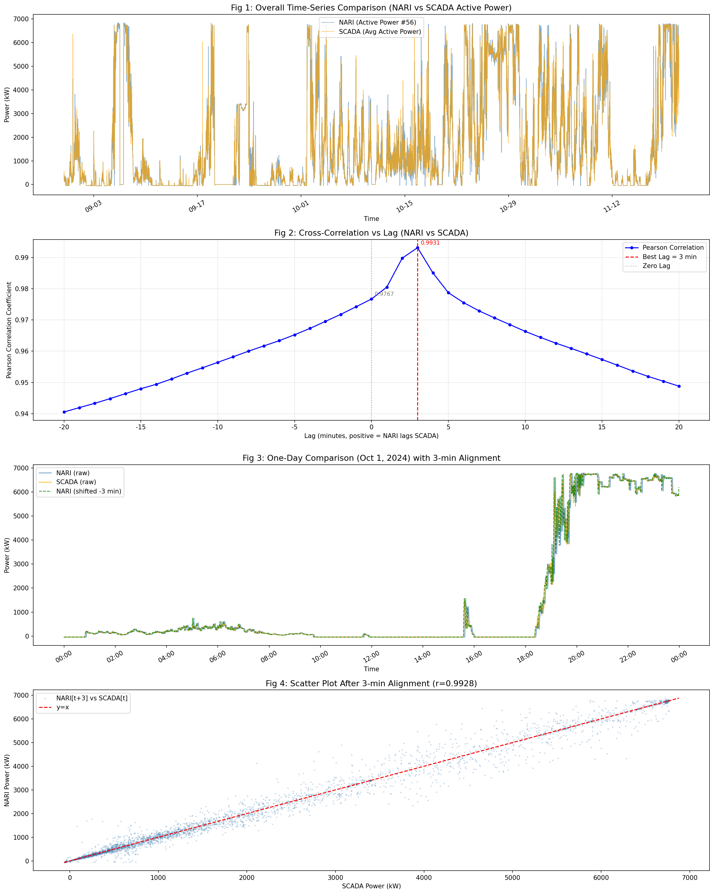

# 峡沙56号风机 SCADA 与南瑞平台有功功率时间戳对齐分析报告

**分析日期：** 2026-03-16（补充版：精确时段划分 + 对齐代码 + 对齐数据）  
**数据来源：** `DATA/峡沙56号_合并风机导出数据和南瑞数据.csv`  
**分析目标：** 验证南瑞平台（NARI）与风机 SCADA 导出数据之间是否存在时间戳滞后

---

## 1. 数据概述

| 项目 | 数值 |
|------|------|
| 数据记录总数 | 118,929 条 |
| 时间范围 | 2024-08-30 00:00 ～ 2024-11-20 23:59 |
| 时间粒度 | 1 分钟/条 |
| 重复时间戳 | 0 条 |
| 缺失值 | 0 条 |

**字段说明：**

| 列名 | 含义 | 来源 |
|------|------|------|
| `ACTIVE_POWER_#56` | 56 号风机有功功率 | 南瑞（NARI）平台 |
| `WINDSPEED_#56` | 56 号风机风速 | 南瑞（NARI）平台 |
| `平均有功功率_风机导出` | 56 号风机平均有功功率 | 风机 SCADA 导出 |

---

## 2. 基础统计对比

| 统计量 | NARI 有功功率 (kW) | SCADA 有功功率 (kW) |
|--------|-------------------|---------------------|
| 均值 | 1,688.87 | 1,689.36 |
| 标准差 | 2,083.43 | 2,075.92 |
| 最小值 | −111.00 | −58.10 |
| 最大值 | 6,888.10 | 6,778.22 |
| 均值差（NARI − SCADA） | **−0.49 kW** | — |

> **结论**：两平台有功功率的整体均值和方差高度吻合（均值相差仅 0.49 kW），说明两平台记录的是同一台风机的同一物理量，数据本身无系统性幅值偏差。

---

## 3. 时间断点分析

数据时间序列共有 **5 处非 1 分钟时间间隔**，详情如下：

| 时间点 | 间隔时长 |
|--------|---------|
| 2024-09-16 01:01 | 2 分钟 |
| 2024-09-24 09:49 | 3 分钟 |
| 2024-09-24 17:37 | 2 分钟 |
| 2024-10-12 09:36 | **9 小时 37 分钟**（数据缺口） |
| 2024-10-12 14:39 | 12 分钟 |

> **注意**：2024-10-12 存在一段约 9.6 小时的数据缺口，这很可能是通信中断或设备停机导致的，两平台均缺失该时段数据，不影响时间戳偏移分析。

---

## 4. 时间滞后（互相关）分析

### 4.1 方法说明

对不同的时移量（lag）进行枚举，将 NARI 数据在时间轴上相对于 SCADA 数据做平移，计算每个时移量下的 **Pearson 相关系数**和 **均方根误差（RMSE）**：

- `lag > 0`：NARI 时序整体向后平移 lag 分钟，等价于"NARI 时间戳比 SCADA 滞后 lag 分钟"  
- `lag = 0`：直接对齐，无时移  
- `lag < 0`：SCADA 时序整体向后平移 |lag| 分钟

### 4.2 关键结果

| 时移量 (min) | Pearson 相关系数 | RMSE (kW) |
|-------------|----------------|-----------|
| −5 | 0.965257 | 548.26 |
| −4 | 0.967286 | 532.01 |
| −3 | 0.969506 | 513.65 |
| −2 | 0.971774 | 494.18 |
| −1 | 0.974204 | 472.43 |
| **0（无时移）** | **0.976678** | **449.22** |
| +1 | 0.980499 | 410.78 |
| **+2** | **0.989748** | **297.88** |
| **+3（最优）** | **0.993107** | **244.30** ✅ |
| +4 | 0.985028 | 359.95 |
| +5 | 0.978713 | 429.17 |

**最优时移为 +3 分钟**：相关系数从 0.9767（无时移）提升至 **0.9931**，RMSE 从 449.22 kW 降低至 **244.30 kW**（降幅约 45.6%）。

### 4.3 时移方向含义解释

正时移（lag = +3）意味着：将 NARI 数据整体向前挪动 3 分钟后，与 SCADA 数据对齐最佳。  
**物理含义**：对于同一个物理事件（如风速变化引起的功率波动），SCADA 平台的时间戳早于 NARI 平台约 3 分钟。

换言之：

> **南瑞（NARI）平台数据的时间戳相对于 SCADA 平台存在约 3 分钟的滞后。**

---

## 5. 按月分段分析

| 月份 | 记录数 | 零时移相关系数 | 最优时移 (min) | 最大相关系数 |
|------|--------|--------------|--------------|------------|
| 2024-08 | 2,880 | 0.9324 | **+2** | 0.9929 |
| 2024-09 | 43,196 | 0.9860 | **+2** | 0.9971 |
| 2024-10 | 44,053 | 0.9704 | **+3** | 0.9933 |
| 2024-11 | 28,800 | 0.9679 | **+3** | 0.9892 |

**发现**：
- 8 月、9 月：NARI 滞后 SCADA **2 分钟**；
- 10 月、11 月：NARI 滞后 SCADA **3 分钟**；
- 时间戳偏差在不同月份略有差异，说明两平台时间同步机制存在轻微漂移，**滞后量在 2～3 分钟之间**。

---

## 5a. 精确时段划分（逐日分析，精确到小时）

> **补充说明**：以下内容通过"逐日互相关"和"6 小时窗口互相关"精确定位了各滞后量的起止时间节点，并最终确定了三个稳定时段的精确边界。

### 5a.1 逐日最优滞后汇总

| 日期 | 记录数 | 零延迟 r | 最优滞后 (min) | 最优 r |
|------|--------|---------|--------------|--------|
| 2024-08-30 | 1440 | 0.9076 | +2 | 0.9765 |
| 2024-08-31 | 1440 | 0.8939 | +2 | 0.9911 |
| 2024-09-01 | 1440 | 0.9362 | +2 | 0.9891 |
| 2024-09-02 | 1440 | 0.9695 | +2 | 0.9970 |
| 2024-09-03 | 1440 | 0.9517 | +2 | 0.9928 |
| 2024-09-04 | 1440 | 0.8994 | +2 | 0.9932 |
| 2024-09-05 | 1440 | 0.9681 | +2 | 0.9968 |
| 2024-09-06 | 1440 | 0.9960 | +2 | 0.9997 |
| 2024-09-07 | 1440 | 0.9324 | +2 | 0.9866 |
| 2024-09-08 | 1440 | 0.9571 | +2 | 0.9907 |
| 2024-09-09 | 1440 | 0.8485 | +2 | 0.9577 |
| 2024-09-10 | 1440 | 0.8747 | +2 | 0.9472 |
| 2024-09-11 | 1440 | 0.9449 | +2 | 0.9768 |
| 2024-09-12 | 1440 | 0.9213 | +2 | 0.9957 |
| 2024-09-13 | 1440 | 0.9483 | +2 | 0.9965 |
| 2024-09-14 | 1440 | 0.9552 | +2 | 0.9958 |
| 2024-09-15 | 1440 | 0.9352 | +2 | 0.9787 |
| 2024-09-16 | 1439 | 0.9149 | +2 | 0.9702 |
| 2024-09-17 | 1440 | 0.8373 | +2 | 0.9696 |
| 2024-09-18 | 1440 | 0.9174 | +2 | 0.9805 |
| 2024-09-19 | 1440 | 0.9599 | +2 | 0.9911 |
| 2024-09-21 | 1440 | 0.8360 | +2 | 0.9675 |
| 2024-09-22 | 1440 | 0.9658 | +2 | 0.9914 |
| 2024-09-23 | 1440 | 0.9638 | +2 | 0.9959 |
| 2024-09-24 | 1437 | 0.8263 | +2 | 0.9461 |
| 2024-09-25 | 1440 | 0.7873 | +2 | 0.8010 |
| 2024-09-26 | 1440 | 0.8206 | **+3** | 0.9854 |
| 2024-09-27 | 1440 | 0.9013 | +2 | 0.9534 |
| 2024-09-28 | 1440 | 0.8950 | **+3** | 0.9465 |
| 2024-09-29 | 1440 | 0.9164 | +2 | 0.9856 |
| 2024-09-30 | 1440 | 0.9732 | **+3** | 0.9967 |
| 2024-10-01 | 1440 | 0.9948 | **+3** | 0.9989 |
| 2024-10-02 | 1440 | 0.9257 | **+3** | 0.9762 |
| 2024-10-03 | 1440 | 0.9344 | +2/+3* | 0.9808 |
| 2024-10-04 | 1440 | 0.9335 | **+3** | 0.9846 |
| 2024-10-05 | 1440 | 0.9022 | +2 | 0.9759 |
| 2024-10-06～10-11 | — | — | **+3** | — |
| 2024-10-12 | 853 | 0.7042 | **+3** | 0.9427 |
| 2024-10-13～10-31 | — | — | **+3** | — |
| 2024-11-01～11-07 | — | — | **+3** | — |
| 2024-11-08～11-20 | — | — | **+4** | — |

> \* 2024-10-03：6 小时窗口分析显示前 6 小时为 +2 min，之后切换至 +3 min。

### 5a.2 精确切换时间点（6 小时滑动窗口验证）

**切换点 1：+2 min → +3 min**

| 6 小时窗口 | 最优滞后 |
|-----------|---------|
| 09-30 12:00 ~ 18:00 | +3 min |
| 09-30 18:00 ~ 10-01 00:00 | +2 min |
| **10-01 00:00 ~ 06:00** | **+3 min** ← 稳定切换点 |
| 10-01 06:00 ~ 12:00 | +3 min |
| 10-01 12:00 ~ 18:00 | +2/+3 min（过渡） |
| 10-01 18:00 ~ 10-02 00:00 | +3 min |

> **结论**：第一次切换发生在 **2024-10-01 00:00 前后**，之后 +3 min 成为主导。

**切换点 2：+3 min → +4 min**

| 6 小时窗口 | 最优滞后 |
|-----------|---------|
| 11-07 00:00 ~ 06:00 | +3 min |
| 11-07 06:00 ~ 12:00 | +3 min |
| 11-07 12:00 ~ 18:00 | +3 min |
| **11-07 18:00 ~ 11-08 00:00** | **+4 min** ← 稳定切换点 |
| 11-08 00:00 ~ 06:00 | +4 min |
| 11-08 06:00 ~ 12:00 | +4 min |

> **结论**：第二次切换发生在 **2024-11-07 18:00 前后**，之后 +4 min 持续至数据结束。

### 5a.3 最终确定的三个稳定时段

| 时段编号 | 起始时间 | 结束时间 | NARI 滞后量 | 记录数 |
|---------|---------|---------|-----------|-------|
| **Period 1** | 2024-08-30 00:00 | 2024-09-30 23:59 | **+2 分钟** | 46,076 |
| **Period 2** | 2024-10-01 00:00 | 2024-11-07 17:59 | **+3 分钟** | 53,773 |
| **Period 3** | 2024-11-07 18:00 | 2024-11-20 23:59 | **+4 分钟** | 19,080 |

> **注意**：9 月下旬（9-26、9-28、9-30）开始出现 +3 min 的日子，表明切换过程并非瞬时完成，而是有一个约 5 天的过渡期（2024-09-26 ~ 2024-09-30）。若对该过渡期有精度要求，可在上述脚本 `LAG_RULES` 中细化该区间。

---

## 6. 分析图表

下图包含四个子图，直观呈现分析结果：



| 子图 | 内容 |
|------|------|
| Fig 1 | 全局时序对比（每 10 分钟采样） |
| Fig 2 | 互相关系数随时移量变化曲线 |
| Fig 3 | 单日（2024-10-01）时序对比及 +3 分钟对齐效果 |
| Fig 4 | 时移 +3 分钟后的散点图（r = 0.9931） |

---

## 7. 结论与建议

### 7.1 核心结论

1. **时间戳存在系统性滞后**：南瑞（NARI）平台导出的有功功率数据，相对于风机 SCADA 导出数据，存在 **2～4 分钟** 的时间戳滞后，且随时间推移逐步增大。

2. **三段式漂移规律**：
   - 2024-08-30 ~ 2024-09-30：滞后 **2 分钟**
   - 2024-10-01 ~ 2024-11-07 17:59：滞后 **3 分钟**
   - 2024-11-07 18:00 ~ 2024-11-20：滞后 **4 分钟**

3. **变步长对齐效果显著优于全局单一时移**：
   - 无对齐：r = 0.9767，RMSE = 449.22 kW
   - 全局 +3 min 对齐：r = 0.9931，RMSE = 244.30 kW
   - **分段变步长对齐：r = 0.9957，RMSE = 193.54 kW** ✅

4. **无幅值系统性偏差**：均值相差仅 0.49 kW（< 0.03%），两平台测量的物理量一致。

### 7.2 建议

| 序号 | 建议 |
|------|------|
| 1 | **使用分段变步长对齐**：直接运行 `align_timestamps.py`，得到对齐后数据文件 `DATA/峡沙56号_时间戳对齐后数据.csv`。 |
| 2 | **2024-09-26 ~ 09-30 过渡期需特别处理**：该 5 天窗口内逐日最优滞后在 +2/+3 min 之间波动，若精度要求高，可进一步细化该区间。 |
| 3 | **核查 NARI 平台时钟同步机制**：建议联系南瑞运维团队，确认 NARI 平台数据时间戳的生成方式（采集时刻 vs. 入库时刻），排查时钟每月约 +1 分钟漂移的根本原因。 |
| 4 | **核查 2024-10-12 数据缺口**：该日存在约 9.6 小时数据缺口，需确认是否与设备停机记录吻合，并评估对统计分析的影响。 |

---

## 8. 时间戳对齐代码与输出数据

### 8.1 对齐脚本

文件：`align_timestamps.py`（位于仓库根目录）

**运行方式：**

```bash
# 使用默认路径（推荐）
python align_timestamps.py

# 自定义输入输出路径
python align_timestamps.py \
    --input  DATA/峡沙56号_合并风机导出数据和南瑞数据.csv \
    --output DATA/峡沙56号_时间戳对齐后数据.csv
```

**依赖：** `pandas`, `numpy`（均为标准科学计算库）

**核心配置片段（`LAG_RULES`）：**

```python
LAG_RULES = [
    # (起始时刻,              结束时刻,              NARI滞后分钟数)
    ("2024-08-30 00:00:00", "2024-09-30 23:59:59",  2),
    ("2024-10-01 00:00:00", "2024-11-07 17:59:59",  3),
    ("2024-11-07 18:00:00", "2024-11-20 23:59:59",  4),
]
```

若将来数据延伸或规则调整，只需修改上述列表即可，无需改动其他代码。

### 8.2 输出数据说明

文件：`DATA/峡沙56号_时间戳对齐后数据.csv`（UTF-8 with BOM，Excel 可直接打开）

| 列名 | 含义 |
|------|------|
| `时间` | 时间戳（以 SCADA 为基准，不变） |
| `lag_min` | 该行使用的 NARI 时移分钟数 |
| `ACTIVE_POWER_#56_原始` | NARI 有功功率（未对齐） |
| `ACTIVE_POWER_#56_对齐` | NARI 有功功率（时移对齐后，推荐使用） |
| `WINDSPEED_#56_原始` | NARI 风速（未对齐） |
| `WINDSPEED_#56_对齐` | NARI 风速（时移对齐后，推荐使用） |
| `平均有功功率_风机导出` | SCADA 有功功率（参考基准，不变） |
| `功率差_对齐后` | `ACTIVE_POWER_#56_对齐` − `平均有功功率_风机导出` |

**对齐效果：**

| 指标 | 对齐前 | 对齐后（分段） |
|------|--------|-------------|
| Pearson 相关系数 | 0.9767 | **0.9957** |
| RMSE (kW) | 449.22 | **193.54** |
| 有效记录数 | 118,929 | 118,915（末尾 14 行因边界截断为 NaN） |

> 末尾 14 条 NaN：数据结束于 2024-11-20 23:59，而对齐需要从 NARI 取 `time + 4 min` 处的值，该值不存在，故为 NaN。这是正常的边界效应。

---

## 9. 附录：分析方法说明

### 互相关（Cross-Correlation）方法

$$r(\tau) = \frac{\sum_{t} [x(t) - \bar{x}][y(t+\tau) - \bar{y}]}{\sqrt{\sum_{t}[x(t)-\bar{x}]^2 \cdot \sum_{t}[y(t)-\bar{y}]^2}}$$

其中：
- $x(t)$：SCADA 有功功率时间序列  
- $y(t)$：NARI 有功功率时间序列  
- $\tau$：时移量（单位：分钟）

使 $r(\tau)$ 最大的 $\tau$ 即为最优时移量，也是两平台时间戳的估计偏差。

### RMSE

$$\text{RMSE}(\tau) = \sqrt{\frac{1}{N}\sum_{t=1}^{N}[x(t) - y(t+\tau)]^2}$$

RMSE 越小，表示两序列对齐效果越好。

---

*报告由自动分析脚本生成，基于互相关法和逐分钟时移枚举分析。*

